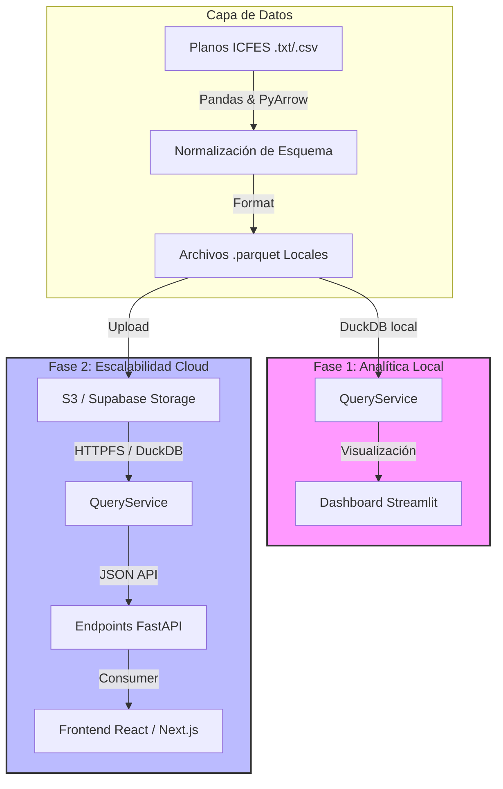

# 📊 ICFES Saber 11 - Plataforma de Analítica (2015-2025)

[](https://www.python.org/)
[](https://github.com/astral-sh/uv)
[](https://duckdb.org/)
[](https://streamlit.io/)
[](https://fastapi.tiangolo.com/)

Plataforma modular de alto rendimiento diseñada para procesar, normalizar y analizar microdatos del ICFES Saber 11 (~4.3 GB de datos históricos de 2015 a 2025). Implementa una arquitectura desacoplada y orientada al dominio ligero para garantizar una transición suave entre entornos locales y en la nube.

---

## 🗺️ Estrategia de Arquitectura y Fases

El proyecto está diseñado bajo principios de **Clean Architecture** estructurado en dos fases:



---

## 📂 Estructura de Directorios

```directory
.
├── .agents/               # Skills y configuraciones de agentes IA
├── files/                 # Almacenamiento local de datos
│   ├── raw/               # Archivos planos del ICFES originales
│   └── parquet/           # Salida procesada y particionada por el ETL
├── queries/               # Repositorio de consultas analíticas SQL puras
│   ├── puntajes_por_depto.sql
│   └── tendencias_anuales.sql
├── src/
│   └── icfes/             # Namespace del paquete principal
│       ├── __init__.py
│       ├── settings.py    # Configuración central (variables de entorno)
│       ├── api/           # Fase 2: Aplicación FastAPI y routers
│       │   ├── __init__.py
│       │   └── main.py
│       ├── core/          # Capa central (Lógica de dominio / QueryService)
│       │   ├── __init__.py
│       │   └── query_service.py
│       ├── dashboard/     # Fase 1: Aplicación Streamlit (arquitectura modular)
│       │   ├── __init__.py
│       │   ├── app.py              # Orquestador delgado: config + tabs + routing
│       │   ├── components/
│       │   │   ├── theme.py        # CSS global + dark_layout()
│       │   │   ├── navbar.py       # render_navbar()
│       │   │   ├── animations.py   # render_animations() — partículas + anime.js
│       │   │   └── sidebar.py      # render_sidebar(svc) → filtros globales
│       │   ├── data/
│       │   │   └── mock.py         # Datos de demostración (mock)
│       │   └── pages/
│       │       ├── inicio.py       # Tab "Inicio"
│       │       ├── analisis.py     # Tab "Análisis" (datos reales via DuckDB)
│       │       ├── comparativa.py  # Tab "Comparativa"
│       │       ├── tendencias.py   # Tab "Tendencias"
│       │       └── acerca_de.py    # Tab "Acerca de"
│       └── etl/           # Pipeline de procesamiento de microdatos
│           ├── __init__.py
│           ├── __main__.py
│           ├── config.py  # Mapeos de columnas históricos
│           ├── pipeline.py# Ejecutor del flujo ETL
│           └── schemas.py # Esquemas estrictos de PyArrow
├── tests/                 # Pruebas unitarias y de integración
├── .env.example           # Plantilla de variables de configuración
├── Makefile               # Automatización de tareas y comandos comunes
├── pyproject.toml         # Configuración del paquete y grupos de dependencias
└── uv.lock                # Archivo de bloqueo estricto de dependencias (uv)
```

---

## ⚙️ Requisitos Previos e Instalación

Este proyecto utiliza [**`uv`**](https://github.com/astral-sh/uv), un gestor de paquetes de Python ultrarrápido escrito en Rust.

### 1. Instalación de `uv`

Instala `uv` en tu sistema según corresponda:

- **Windows (PowerShell):**
  ```powershell
  powershell -ExecutionPolicy ByPass -c "irm https://astral.sh/uv/install.ps1 | iex"
  ```
- **macOS / Linux:**
  ```bash
  curl -LsSf https://astral.sh/uv/install.sh | sh
  ```

### 2. Configuración del Entorno

Ejecuta el asistente de inicio para crear tu archivo de configuración local `.env`:

```bash
make setup
```

Abre el archivo `.env` recién creado y define las rutas locales y credenciales necesarias.

### 3. Instalación de Dependencias

Puedes realizar una instalación completa o modular según el rol:

- **Completo (Desarrollo y Testeo):**
  ```bash
  make install
  ```
- **Solo ETL:**
  ```bash
  make install-etl
  ```
- **Solo Dashboard Analítico:**
  ```bash
  make install-dashboard
  ```
- **Solo API (FastAPI):**
  ```bash
  make install-api
  ```

---

## 🚀 Uso de Comandos (Makefile)

El archivo `Makefile` expone comandos rápidos para desarrollo, ejecución y pruebas:

| Comando              | Acción / Descripción                                             |
| :------------------- | :--------------------------------------------------------------- |
| **`make setup`**     | Inicializa `.env` a partir de `.env.example` si no existe.       |
| **`make install`**   | Sincroniza todas las dependencias y extras del entorno virtual.  |
| **`make etl`**       | Ejecuta el pipeline ETL para transformar datos raw en Parquet.   |
| **`make dashboard`** | Arranca el frontend analítico interactivo con Streamlit.         |
| **`make api`**       | Inicia el servidor de desarrollo FastAPI con recarga automática. |
| **`make lint`**      | Realiza el análisis estático de código usando `Ruff`.            |
| **`make lint-fix`**  | Corrige automáticamente problemas de linting.                    |
| **`make format`**    | Aplica formato al código de acuerdo con las reglas de estilo.    |
| **`make test`**      | Ejecuta el set de pruebas unitarias y cobertura de código.       |
| **`make clean`**     | Elimina artefactos temporales de compilación y pycaches.         |

---

## 🛠️ Estrategia para Nuevas Implementaciones

La arquitectura modular permite expandir la plataforma fácilmente siguiendo estas directrices:

### 1. Agregar una Nueva Consulta Analítica (SQL)

Para mantener las vistas analíticas aisladas y reutilizables:

1. Crea un nuevo archivo `.sql` en el directorio `queries/` (ej. `queries/mi_consulta.sql`).
2. Utiliza la sintaxis estándar de DuckDB. Apunta a la tabla/fuente usando el placeholder `{parquet}`.
   ```sql
   SELECT ano, cole_genero, AVG(cast(punt_global AS DOUBLE))
   FROM {parquet}
   GROUP BY ALL;
   ```
3. Ejecútalo mediante el `QueryService` en tu dashboard o API:
   ```python
   with make_query_service() as svc:
       df = svc.query_df(pathlib.Path("queries/mi_consulta.sql").read_text())
   ```

### 2. Modificar el Pipeline ETL (Esquemas o Nuevas Columnas)

Si los archivos planos de entrada cambian de formato o se añade una columna:

1. Actualiza el mapeo en [config.py](file:///f:/Mis%20Documentos/INTEP/Semestre%207/Analisis%20de%20datos/Proyecto%20final/Icfes/ETL/src/icfes/etl/config.py) agregando la columna histórica.
2. Modifica el esquema esperado en [schemas.py](file:///f:/Mis%20Documentos/INTEP/Semestre%207/Analisis%20de%20datos/Proyecto%20final/Icfes/ETL/src/icfes/etl/schemas.py) con su tipo PyArrow correspondiente para validar la salida.
3. Ejecuta `make etl` para reconstruir los archivos parquet locales.

### 3. Crear Nuevos Endpoints en la API

Para exponer datos a clientes externos (como un frontend React):

1. Abre [main.py](file:///f:/Mis%20Documentos/INTEP/Semestre%207/Analisis%20de%20datos/Proyecto%20final/Icfes/ETL/src/icfes/api/main.py).
2. Define el endpoint y utiliza la variable global de servicio de consultas `_svc`:
   ```python
   @app.get("/puntajes/genero")
   async def puntajes_por_genero():
       df = _svc.query_df("SELECT cole_genero, AVG(cast(punt_global AS DOUBLE)) FROM {parquet} GROUP BY cole_genero")
       return df.to_dict(orient="records")
   ```

### 4. Agregar o Modificar el Dashboard (Páginas y Componentes)

El dashboard usa una arquitectura de **componentes + páginas**. Cada tab es un módulo independiente con una función `render()`.

#### Agregar un nuevo tab/menú

1. Crea `src/icfes/dashboard/pages/mi_pagina.py`:
   ```python
   import streamlit as st
   from icfes.dashboard.components.theme import dark_layout

   def render():
       st.markdown("## Mi nueva sección")
       # ... tu contenido aquí
   ```

2. Registra el tab en `app.py`:
   ```python
   from icfes.dashboard.pages import mi_pagina
   # ...
   tab_nuevo, = st.tabs(["🆕 Mi Página"])  # añadir al st.tabs existente
   # ...
   with tab_nuevo:
       mi_pagina.render()
   ```

3. Si el tab necesita datos reales, recibe `svc` y `where_clause` como parámetros:
   ```python
   def render(svc, where_clause: str):
       df = svc.query_df(f"SELECT ... FROM {{parquet}} {where_clause}")
   ```

#### Modificar estilos globales

- CSS global → `components/theme.py` (variable `CSS`)
- Preset Plotly oscuro → `components/theme.py` función `dark_layout(**extra)`
- Navbar → `components/navbar.py`
- Animaciones (partículas / anime.js) → `components/animations.py`

#### Agregar datos de demostración (mock)

Añade funciones en `data/mock.py` y usa `@st.cache_data` si son costosas de generar:
```python
def mock_nueva_data() -> pd.DataFrame:
    return pd.DataFrame(...)
```

#### Modificar los filtros globales del sidebar

Edita `components/sidebar.py`. La función `render_sidebar(svc)` retorna
`(where_clause, sel_anos, sel_deptos, sel_genero, sel_naturaleza)`.
Para agregar un nuevo filtro, añade el widget dentro del `with st.sidebar:` y
actualiza la lista `filters` con la cláusula SQL correspondiente.

---

### 5. Transición a Nube (Fase 2)

Para mover el backend analítico a producción sin tocar el código fuente:

1. Sube tus archivos `.parquet` a un bucket de **AWS S3** o **Supabase Storage**.
2. Modifica tu archivo `.env`:
   ```ini
   STORAGE_BACKEND=supabase # O 's3'
   SUPABASE_S3_ENDPOINT=https://xxxx.supabase.co/storage/v1/s3
   SUPABASE_ACCESS_KEY=your-access-key
   SUPABASE_SECRET_KEY=your-secret-key
   SUPABASE_PARQUET_PATH=s3://icfes-parquet/
   ```
3. El `QueryService` inicializará DuckDB instalando la extensión `httpfs`, autenticando vía S3 API y leyendo los ficheros remotos de manera transparente.
