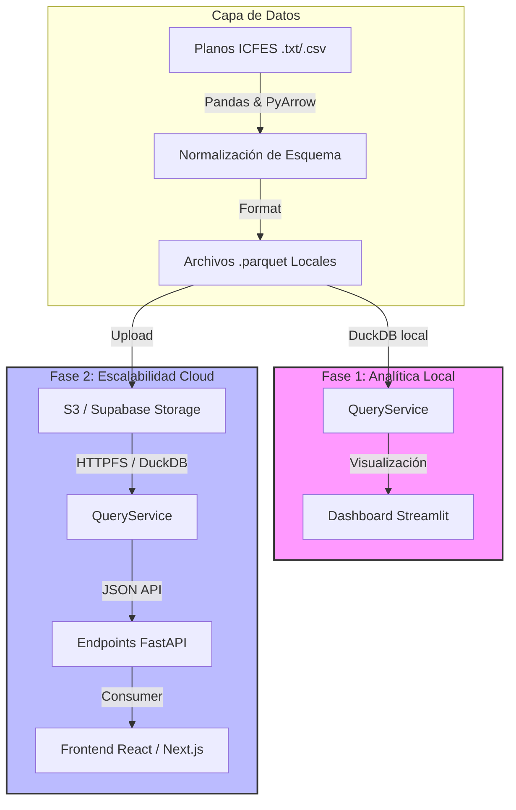

# 📊 ICFES Analytics — Saber 11 (2015–2025)

[](https://www.python.org/)
[](https://github.com/astral-sh/uv)
[](https://duckdb.org/)
[](https://streamlit.io/)
[](https://fastapi.tiangolo.com/)

Plataforma modular de analítica educativa sobre microdatos ICFES Saber 11 (~4.3 GB, 2015–2025). Arquitectura desacoplada ETL → DuckDB → Streamlit, diseñada para escalar a FastAPI + Supabase en Fase 2.

---

## 🗺️ Arquitectura

El proyecto está diseñado bajo principios de **Clean Architecture** estructurado en dos fases:

```
Fase 1 (actual)              Fase 2 (futura)
─────────────────            ─────────────────
.txt/.csv (raw)              S3 / Supabase Storage
     │ PyArrow ETL                │ DuckDB httpfs
     ▼                            ▼
 .parquet local          QueryService (mismo API)
     │ DuckDB                     │
     ▼                            ▼
QueryService              FastAPI endpoints
     │                            │
     ▼                            ▼
Streamlit Dashboard       React / Next.js
```



---

## 📂 Estructura de Directorios

```
.
├── files/
│   ├── raw/              # Planos ICFES originales (.txt)
│   └── parquet/          # Salida procesada por ETL (.parquet snappy)
├── models/
│   └── simulador_models.pkl   # Bundle multi-modelo (Ridge + RF + GBR)
├── queries/              # SQL reutilizables con placeholder {parquet}
├── scripts/
│   └── train_simulador.py     # Entrena los 3 modelos ML y guarda bundle
├── src/
│   └── icfes/
│       ├── settings.py         # Config central (env vars, rutas, backend)
│       ├── logger.py           # Logger configurado
│       ├── etl/                # Pipeline de procesamiento de microdatos
│       │   ├── config.py       # Mapeos de columnas históricos
│       │   ├── pipeline.py     # Ejecutor del flujo ETL
│       │   └── schemas.py      # Esquemas estrictos PyArrow
│       ├── core/
│       │   └── query_service.py  # Abstracción DuckDB, backends: local/S3/Supabase
│       ├── api/
│       │   └── main.py         # FastAPI stub (Fase 2)
│       └── dashboard/
│           ├── app.py          # Orquestador: config + tabs + routing + sidebar
│           ├── components/
│           │   ├── theme.py        # CSS global oscuro + dark_layout()
│           │   ├── navbar.py       # render_navbar()
│           │   ├── animations.py   # Partículas + anime.js
│           │   └── sidebar.py      # Filtros globales → (where_clause, filtros...)
│           ├── data/
│           │   └── mock.py         # Datos de demo / fallback
│           ├── ai/                 # Módulo de IA Generativa (Gemini)
│           │   ├── client.py       # Cliente Gemini centralizado + key management + generate()
│           │   └── prompts/
│           │       ├── __init__.py
│           │       ├── perfilamiento.py  # build_colectivo() + build_individual()
│           │       │                     # Secciones: ROL · CONTEXTO APP · DESTINATARIO
│           │       │                     #            DATOS ANALIZADOS · TIPO RESPUESTA
│           │       └── priorizacion.py  # build_intervencion_ipe()
│           │                            # Secciones: ROL · CONTEXTO APP · DESTINATARIO
│           │                            #            DATOS IPE · ESCALA REFERENCIA · TIPO RESPUESTA
│           └── pages/
│               ├── inicio.py       # Pantalla de bienvenida + cards de navegación
│               ├── analisis.py     # KPIs + tendencia + radar + mapa departamentos
│               ├── comparativa.py  # Equidad por género, naturaleza, área urbana/rural
│               ├── tendencias.py   # Tendencias históricas + proyección OLS post-COVID
│               ├── coordinador.py  # Brechas institucionales + impacto socioeconómico
│               ├── secretario.py   # Equidad regional Oficial/Privado + Urbano/Rural
│               ├── simulador.py    # Simulador ML multi-modelo + benchmark
│               ├── priorizacion.py # IPE + ranking instituciones + IA Gemini
│               ├── perfilamiento.py# Perfiles vocacionales + IA Gemini (oculto en menú)
│               ├── covid.py        # Análisis impacto pandemia Pre/Durante/Post
│               └── acerca_de.py    # Documentación del sistema
└── pyproject.toml
```

---

## 🧭 Navegación del Dashboard

```
🏠 Inicio
📊 Explorar
    ├── Análisis       — KPIs, tendencia global, radar competencias, mapa departamentos
    └── Tendencias     — Evolución histórica áreas + proyección OLS post-COVID 2026–2027
🎓 Herramientas
    ├── Coordinador    — Brecha institucional vs nacional + impacto internet/trabajo
    ├── Secretario     — Tendencia Oficial/Privado + Urbano/Rural por depto/municipio
    ├── Simulador      — Predicción ML 3 modelos: Ridge, Random Forest, Gradient Boosting
    └── Priorización IPE — Ranking urgencia intervención + diagnóstico IA Gemini
🦠 COVID-19            — Análisis Pre/Durante/Post pandemia por área, depto y género
ℹ️ Acerca de
```

---

## 📄 Features por Módulo

### `analisis.py`

- KPIs: total estudiantes, prom. global, matemáticas, lectura, depto líder
- Tendencia anual del puntaje global con rango Y dinámico
- Radar de competencias por área (5 áreas)
- Mapa horizontal todos los departamentos ordenado por promedio
- Filtros globales desde sidebar: año, depto, género, naturaleza

### `tendencias.py`

- Serie histórica por área (Matemáticas, Lectura, C. Naturales, Sociales, Inglés)
- Proyección OLS **solo sobre datos post-COVID (2022+)** para evitar distorsión del valle pandémico
- Métricas del modelo: R², MSE, RMSE, pendiente, nivel de confianza
- Histograma de distribución del puntaje global

### `coordinador.py`

- Selector de institución por código DANE (agrupa historial aunque cambie de nombre)
- Gráfico divergente de brecha por área vs promedio nacional (barras rojo/verde con 0 al centro)
- Impacto del internet en el hogar: barras por área (Con Internet / Sin Internet / Dato desconocido)
- Impacto horas de trabajo semanal: barras promedio global por categoría, filtrado por institución

### `secretario.py`

- Filtros: departamento, municipio, naturaleza (Oficial/No Oficial)
- Tendencia Oficial vs No Oficial lado a lado con Urbano vs Rural (2 columnas)
- KPIs rezago post-pandemia: prom. pre/durante/post + caída + índice recuperación
- Escala Y dinámica en gráficos para amplificar diferencias visibles

### `simulador.py`

- Selección geográfica en pasos: Nacional → Municipio → Colegio (opcional/requerido)
- 3 modelos entrenados simultáneamente: Ridge Regression, Random Forest, Gradient Boosting
- Tarjetas de resultado por modelo — el mejor (mayor R² test) destacado con borde de color y glow
- Gráfico comparativo: Real + predicción de cada modelo en barras paralelas
- Métricas visibles: R² test, R² CV (5-fold), RMSE, MSE, n entrenamiento
- Detalle técnico (expander): tabla benchmark con gradient, radar multi-métrica, coeficientes del mejor modelo
- Granularidad de entrenamiento: colegio × municipio × año (vs año global anterior)

### `priorizacion.py`

- IPE (Índice Priorización Educativa): compuesto de deterioro académico 40% + brecha digital 30% + vulnerabilidad familiar 30%
- Ranking de instituciones con mayor urgencia de intervención
- Diagnóstico IA por institución usando Gemini 2.0 Flash

### `covid.py`

- Timeline visual Pre-COVID (2015–2019) / Pandemia (2020–2021) / Post-COVID (2022+)
- KPIs: promedio por período, caída pandemia, índice de recuperación
- Evolución anual del puntaje global con banda roja sombreada en años COVID
- Análisis por área de conocimiento agrupado por período
- Caída y recuperación por departamento
- Brecha de género por período
- Calculadora de recuperación interactiva

### `perfilamiento.py` _(oculto en menú actual)_

- Clasificación algorítmica en perfiles: STEM, Salud, Humanidades, Admin, Idiomas, Generalista
- Vista colectiva (institución) e individual (estudiante)
- Consistencia histórica del perfil dominante (series temporales)
- Diagnóstico ejecutivo con IA Gemini — justificación + recomendaciones pedagógicas/vocacionales

---

## 🤖 Módulo IA (`dashboard/ai/`)

Cliente Gemini centralizado con prompts estructurados:

| Módulo                     | Rol                          | Destinatario            | Prompt                                                   |
| -------------------------- | ---------------------------- | ----------------------- | -------------------------------------------------------- |
| `perfilamiento` colectivo  | Consultor política educativa | Rector / Secretaría     | Justificación perfil + 2 recomendaciones institucionales |
| `perfilamiento` individual | Orientador vocacional        | Estudiante grado 11     | ¿Por qué este perfil? + carrera a explorar               |
| `priorizacion`             | Consultor políticas públicas | Secretario de Educación | Diagnóstico IPE + 2 acciones de intervención             |

Configuración: `GEMINI_API_KEY` en `.streamlit/secrets.toml` o variable de entorno.

---

## 🧪 Modelo ML — Simulador Predictivo

Entrenamiento granular por `colegio × municipio × año` (miles de filas vs ~10 anuales antes).

| Modelo            | Descripción                                   |
| ----------------- | --------------------------------------------- |
| Ridge Regression  | Linear con regularización L2 + StandardScaler |
| Random Forest     | 200 árboles, max_depth=12, min_samples_leaf=5 |
| Gradient Boosting | 300 estimadores, lr=0.05, max_depth=4         |

**Evaluación honesta**: split temporal (test = últimos 2 años) + CV 5-fold sobre train.

**Variables predictoras**: `pct_internet`, `pct_educacion_sup`, `promedio_estrato`

**Entrenar:**

```bash
uv run python scripts/train_simulador.py
```

---

## ⚙️ Instalación

```bash
# Instalar uv
powershell -ExecutionPolicy ByPass -c "irm https://astral.sh/uv/install.ps1 | iex"

# Entorno completo
make install

# Solo dashboard
make install-dashboard

# Solo ETL
make install-etl
```

---

## 🚀 Comandos

| Comando                                    | Descripción                                                                                      |
| ------------------------------------------ | ------------------------------------------------------------------------------------------------ |
| `make etl`                                 | Procesa raw → parquet                                                                            |
| `make dashboard`                           | Inicia Streamlit                                                                                 |
| `make api`                                 | Inicia FastAPI (Fase 2)                                                                          |
| `make lint`                                | Análisis estático Ruff                                                                           |
| `make lint-fix`                            | Corrige problemas de linting automáticamente                                                     |
| `make format`                              | Aplica formato al código                                                                         |
| `make test`                                | Tests unitarios                                                                                  |
| `make clean`                               | Elimina artefactos temporales y pycaches                                                         |
| `uv run python scripts/train_simulador.py` | Entrena los 3 modelos ML del simulador (Ridge + RF + GBR) y guarda `models/simulador_models.pkl` |

---

## 🗄️ Backends de Datos

Controlado por `STORAGE_BACKEND` en `.env`:

| Backend           | Descripción                    |
| ----------------- | ------------------------------ |
| `local` (default) | Parquet en `files/parquet/`    |
| `s3`              | AWS S3 via DuckDB httpfs       |
| `supabase`        | Supabase Storage S3-compatible |

---

## 🔑 Variables de Entorno

**`.env`**

```ini
STORAGE_BACKEND=local
PARQUET_PATH=files/parquet

# Supabase (Fase 2)
SUPABASE_S3_ENDPOINT=https://xxxx.supabase.co/storage/v1/s3
SUPABASE_ACCESS_KEY=...
SUPABASE_SECRET_KEY=...
SUPABASE_PARQUET_PATH=s3://icfes-parquet/
```

**`.streamlit/secrets.toml`** ← requerido para habilitar diagnósticos IA en el dashboard

```toml
GEMINI_API_KEY = "AIza..."
```

> El cliente Gemini busca la key primero en `st.secrets["GEMINI_API_KEY"]` y luego en la variable de entorno `GEMINI_API_KEY`. Si ninguna está configurada, los botones de IA quedan deshabilitados sin romper el resto del dashboard.

---

## 🛡️ Notas Técnicas

- **NaN en `punt_ingles`**: columna con datos faltantes frecuentes. En gráficas de tendencia/comparativa → tratado como `0` (no excluye la fila). En perfilamiento → tratado como `NULL` (AVG lo ignora, no distorsiona el perfil).
- **`ano` como float**: DuckDB puede retornar años como `2015.0`. Todas las queries usan `CAST(ano AS INTEGER)`.
- **Filtros SQL**: `where_clause` siempre comienza con `WHERE` cuando tiene contenido. Condiciones adicionales se encadenan con `AND`.
- **Código DANE**: `coordinador.py` filtra instituciones por `cole_cod_dane_establecimiento` para agrupar correctamente aunque cambien de nombre.
